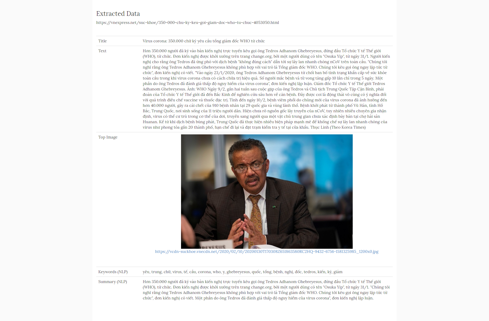

Newspaper summary
======

An attempt to build a summaration for any url with [newspaper3k](https://pypi.org/project/newspaper3k/).

Articles and news are often quite long, and only partly are the content we really need to care about. My purpose is to create a tool that shortens unimportant content so that we can save time when reading this news or content.

The end goal is a page with content summarized and sharable via url [like this](http://summary.thang.ws/articles/show?url_to_clean=https%3A%2F%2Fvnexpress.net%2Fsuc-khoe%2F350-000-chu-ky-keu-goi-giam-doc-who-tu-chuc-4053050.html)

```
http://summary.thang.ws/articles/show?url_to_clean=https%3A%2F%2Fvnexpress.net%2Fsuc-khoe%2F350-000-chu-ky-keu-goi-giam-doc-who-tu-chuc-4053050.html
```



## Features

* Newspaper/Content summarized
* Get a pretty, sharable url.

## TODO

* [ ] Support themes [TODO]
* [ ] Related contents [TODO]
* [ ] Provide API [TODO]

## Usage

You can setup a bookmarklet to use this.

```
javascript:(function(){window.open('https://summary.thang.ws/articles/show?url_to_clean='+window.location.href, '_blank')})()
```
